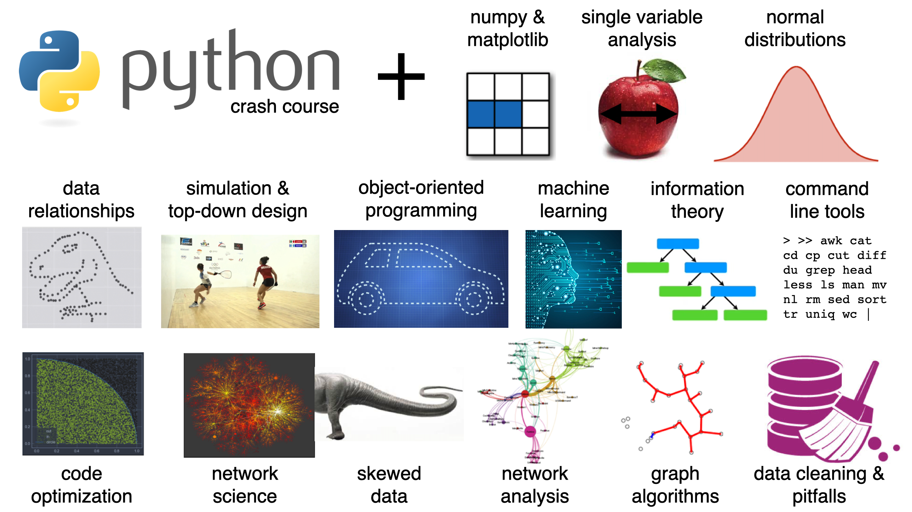

# Course materials for: Introduction to Data Science and Programming
These course materials cover the second half of the course held in fall 2019, improved over fall 2020, extended and improved again in 2023, at IT University of Copenhagen. Public course pages:  
2019: https://learnit.itu.dk/local/coursebase/view.php?ciid=282  
2020: https://learnit.itu.dk/local/coursebase/view.php?ciid=522  
2023: https://learnit.itu.dk/local/coursebase/view.php?ciid=1218

## Topics

The covered topics are:

### Python Crash Course

* Operators and data types
* Lists, functions, conditions
* Program flow
* Dictionaries
* Strings, text files, and IO
* Comprehensions, shell and scripting
* Recursion, file formats, and pandas
* Applications and conda
* Web scraping

### Data Science

* Array programming with numpy 
* Single variable analysis
* Normal distributions
* Data relationships
* Simulation and top-down design
* Object-oriented programming
* Code optimization
* Introduction to network science
* Skewed data
* Network analysis and visualization
* Graph algorithms
* Machine learning
* Information theory
* Data cleaning and pitfalls

These topics come after the first half of the course (not included here) which covers programming fundamentals in Python.

## Sources
The course materials were adapted from a number of sources. All materials were used for educational, non-commercial reasons only. Feel free to use as you wish for the same purpose, at your own risk. For other re-use questions please consult the license of the respective source:

* Scientific Python course by Roberta Sinatra
* A lecture of J.R. Johansson (http://jrjohansson.github.io)
* Python for Data Analysis by Wes McKinney
* Introduction to the practice of statistics by D.S. Moore and G.R. McCabe
* Python Programming by John Zelle
* https://www.thedigitalcatonline.com/blog/2015/03/14/python-3-oop-notebooks/
* https://github.com/UofTCoders/studyGroup/tree/gh-pages/lessons/python/classes
* https://www.thedigitalcatonline.com/blog/2015/03/14/python-3-oop-notebooks/
* https://towardsdatascience.com/speed-up-jupyter-notebooks-20716cbe2025
* https://jakevdp.github.io/PythonDataScienceHandbook/01.07-timing-and-profiling.html
* https://people.duke.edu/~ccc14/sta-663/MakingCodeFast.html
* Network Science by A.L. Barabasi
* Networks: An Introduction by M.E.J. Newman
* Bruno Gonçalves / Data4Sci: https://github.com/DataForScience/Networks
* James Bagrow: http://bagrow.com/dsv/
* A network science class by Sean Cornelius and Emma Thompson